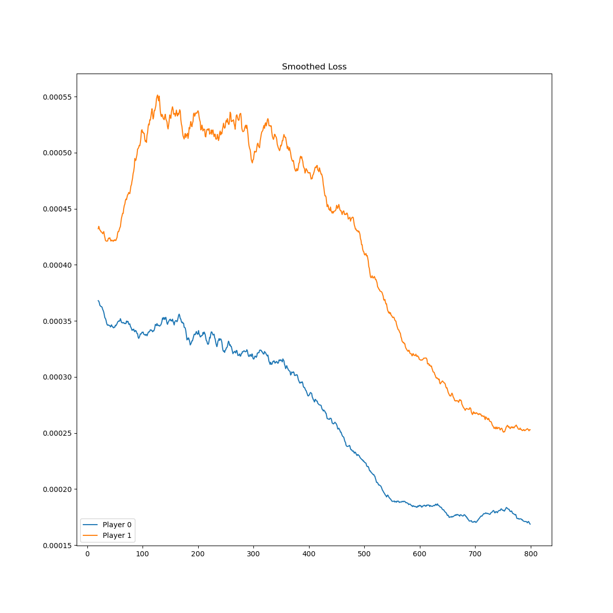
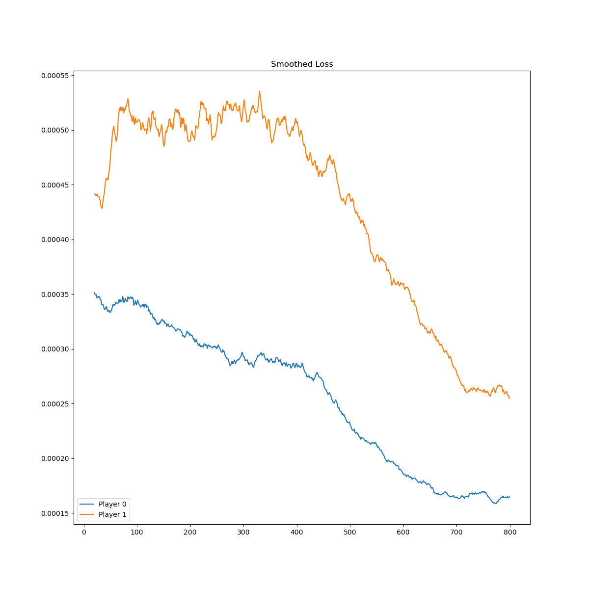
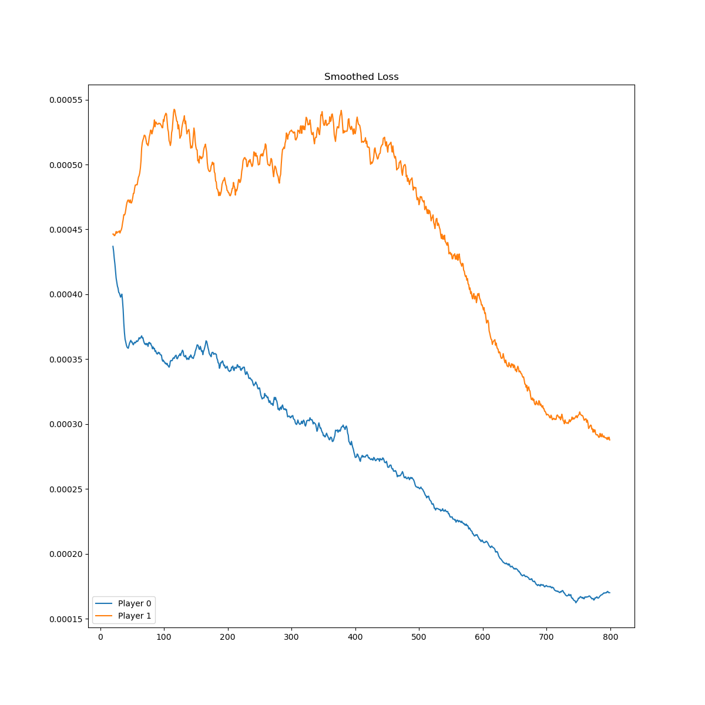
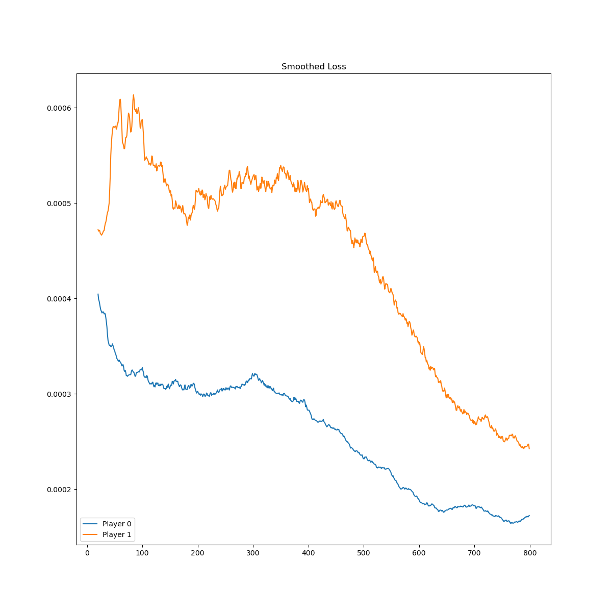

# Experiments on a toy example: Tic-Tac-Toe

The goal of this note is to record the results of some experiments conducted while attempting to train bots using reinforcement learning techniques guided by neural networks, for example tuning hyperparameters or playing with different model architectures.  Though we intend to train bots to play different games, we restrict our attention in this note to Tic-Tac-Toe, for which bots can be quickly trained on essentially any modern computer without special equipment.

## Deep Q-networks (DQN)

In a 2015 paper[^MKS15], Minh, Kavukcuoglu, Silver *et. al.* outline an algorithm for using neural networks within a Q-learning algorithm (DQN) to train bots to play various player vs. environment (PvE) games on the Atari video game platform.  The same algorithms may be readily adapted to PvP games by giving each player their own Q-function, with each player considering the other players as part of the environment.  Unlike the PvE setting, the ``environment'' is now no longer given by a static and fixed (stochastic) Markov decision process, but one which evolves along with the player.  We do not investigate whether the theoretical assumptions justifying Q-learning algorithms remain valid in this set-up, but experimentally we find that they are still able to train good bots.

I made a few minor design modifications to the DQN algorithm (as well as ignoring issues that obviously do not arise in our setting).  I simulate games in batches, which is not difficult due to the very discrete nature of the games we consider, which should give a speed boost; this introduces the size of the simulation batches as an additional hyperparameter.

We also note that convergence alone (i.e. vanishing of loss) does not necessarily indicate a good bot, since its performance *in natura* depends on the quality of the generated training data.  Ensuring good data often means not letting the behavior policy get too greedy.  Due to the random play, this means the loss typically has a non-zero lower bound.  I personally found it helpful to conceptually separate the simulation of data and the learning on that simulated data.

### Dealing with illegal moves ###

There is an immediate design choice that needs to be made: how to handle illegal moves by the bot.  Because the bot plays deterministically, if left unhandled it is possible for the bot to get stuck in infinite loops attempting illegal moves.  In classical Q-learning, actions are just a set and it is straightforward to restrict the set of moves to legal ones.  In deep Q-learning, actions are represented by basis vectors in a fixed vector space, and it is possible for the neural network to select an illegal move.  I saw three solutions:
+ **Randomness:** choose a random action when an illegal action is chosen.
+ **Prohibition:** prohibit illegal moves by zeroing out their corresponding components.
+ **Penalty:** teach the bot to avoid illegal moves by assigning a penalty to illegal moves.
Randomness appeared to me strictly inferior to prohibition, so I didn't experiment with it.  Below are the loss curves comparing prohibition and penalty for a residual neural network and a straightforward linear neural network.
<center<

Prohibition (left two) vs. penalty (right two) loss curves.

One can see that the prohibition curves appear to have more local variance, likely due to the bot choosing exploration and then an illegal move being a fairly common occurrence.  In terms of performance, they seemed to be fairly similar, sometimes one perfoming better than the other.  However, the loss curves seem to exhibit more convergence for prohibition and some metrics depicted in Figure \ref{illegal moves metrics} seem to indicate that prohibition should perform better in general; intuitively this makes sense as there is less to learn.  In particular, for Test 1, we see that we tend to see much more separation between the green curve and the blue/orange curves using prohibition, an indication that the bot is learning to distinguish a particular group of losing moves vs. tying moves.

[^MKS15]: Volodymyr Mnih, Koray Kavukcuoglu, David Silver, *et. al.*, Human-level control through deep reinforcement learning, *Nature* volume 518, pages 529–533 (2015).

[^SH16]: David Silver Aja Huang, *et. al.*, Mastering the game of Go with deep neural networks and tree search, *Nature* volume 529, pages 484-489 (2016).
		
[^SSS17]: David Silver, Julian Schrittwieser, Karen Simonyan, *et. al.*, Mastering the game of Go without human knowledge, *Nature* volume 550, pages 354-359 (2017).

