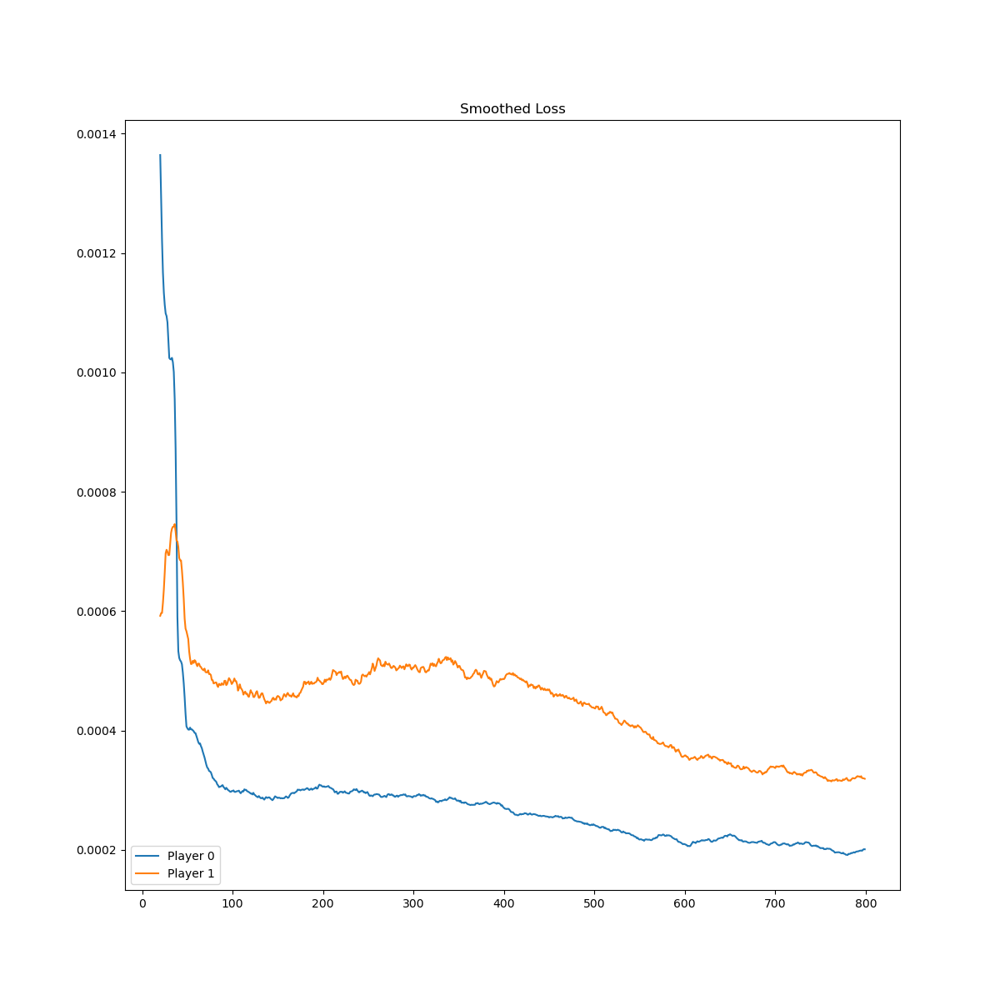

# Experiments on a toy example: Tic-Tac-Toe

The goal of this note is to record the results of some experiments conducted while attempting to train bots using reinforcement learning techniques guided by neural networks, for example tuning hyperparameters or playing with different model architectures.  I train bots to play a game from scratch, i.e. without human knowledge like AlphaZero[^SSS17] as opposed to AlphaGo[^SH16].  Though I intend to train bots to play more sophisticated games, we restrict our attention in this note to Tic-Tac-Toe, for which bots can be quickly trained on essentially any modern computer without special equipment.

# Deep Q-networks (DQN)

In a 2015 paper[^MKS15], Minh, Kavukcuoglu, Silver *et. al.* outline an algorithm for using neural networks within a Q-learning algorithm (DQN) to train bots to play various player vs. environment (PvE) games on the Atari video game platform.  The same algorithms may be readily adapted to PvP games by giving each player their own Q-function, with each player considering the other players as part of the environment.  Unlike the PvE setting, the "environment" is now no longer given by a static and fixed (stochastic) Markov decision process, but one which evolves along with the player.  We do not investigate whether the theoretical assumptions justifying Q-learning remain valid in this set-up, but experimentally we find that the algorithm is still able to train good bots.

I made a few minor design modifications to the DQN algorithm (as well as ignoring issues that obviously do not arise in our setting).  I simulate games in batches, which is not difficult due to the very discrete nature of the games we consider, which should give a speed boost; this introduces the size of the simulation batches as an additional hyperparameter.

To evaluate the training of bots, we use the following metrics.
+ First, we can visualize the loss curves (which we smooth with an averaging kernel of width 11 for readability).  Convergence alone (i.e. vanishing of loss) does not necessarily indicate a good bot, since its performance *in natura* depends on the quality of the generated training data.  Ensuring good data often means not letting the behavior policy get too greedy.  Due to the random play, this means the loss typically has a non-zero lower bound.  I personally found it helpful to conceptually separate the simulation of data and the learning on that simulated data.
+ Next, I chose one test scenario for each player where the player's next moves could be easily separated into good and bad moves, and plotted statistics related to the values of the Q-function for those moves.  This tests whether the bot has learned the best strategy in this scenario.  However, sometimes the bot has the ability to avoid this particular branch of the tree, and therefore can safely ignore these strategies.
+ Finally, I ran 10,000 simulations of the bot against a random player and report the number of wins, loss and ties (and possibly invalid moves attempted) at the end of training.  I sometimes also record the time for training, though this was done on a CPU, not a GPU, so should not be taken too seriously.

## Dealing with illegal moves

There is an immediate design choice that needs to be made: how to handle illegal moves by the bot.  Because the bot plays deterministically, if left unhandled it is possible for the bot to get stuck in infinite loops attempting illegal moves.  In classical Q-learning, actions are just a set and it is straightforward to restrict the set of moves to legal ones.  In deep Q-learning, actions are represented by basis vectors in a fixed vector space, and it is possible for the neural network to select an illegal move.  I saw three solutions:
+ **Randomness:** choose a random action when an illegal action is chosen.
+ **Prohibition:** prohibit illegal moves by zeroing out their corresponding components.
+ **Penalty:** teach the bot to avoid illegal moves by assigning a penalty to illegal moves.

### Penalty vs. prohibition

Randomness appeared to me strictly inferior to prohibition, so I didn't experiment with it.  Below are the loss curves comparing prohibition and penalty.

   

Prohibition (left two; linear and residual architectures) vs. penalty (right two; linear and residual architectures).

The prohibition curves appear more noisy, likely since it is common for the bot to choose an illegal move during exploration and incur a penalty.  In terms of final performance against a random player, they seemed to be fairly similar, sometimes one perfoming better than the other.  The loss curves seem to exhibit more convergence for prohibition; intuitively this makes sense as there is less to learn.  Moreover, some specific case metrics seem to indicate that prohibition should perform better in general:

   
   

Performance metrics for prohibition (left two) vs. penalty (right two).

In particular, for Test 1, we tend to see much more separation between the green curve and the blue/orange curves using prohibition, an indication that the bot is learning to distinguish a particular group of losing moves vs. tying moves.

I implemented penalty first since it was more straightforward, but later switched to prohibition.  Many experiments in the remainder of the document use penalty; one unintended benefit of this is that the number of illegal moves attempted by the bot can be used as a metric for how well the bot has learned the basic rules of the game.

### Magnitude of penalty

The magnitude of the penalty has an effect on neural network training where it does not in classical Q-learning.  For classical Q-learning, the function is an arbitrary function on a discrete set of states.  For deep Q-learning, the function is ``built from'' linear functions defined on a vector space continuum (but only evaluated on a discrete subset).  In particular, for deep Q-learning, large values can skew the weights during training.  In the beginning, I had set the penalty to -1000, which worked classically but caused divergence when training neural networks.  I tested this in an experiment comparing penalties of -2 vs. -1000.  I also tested a penalty of -1, which was not significantly different from a penalty of -2.

 

Loss curve over 4000 iterations: -1000 penalty (left) vs. -2 penalty (right).

<table align="center">
<tr><th>iterations</th><th colspan="2">1000</th><th colspan="2">1500</th><th colspan="2">4000</th></tr>
<tr><th>penalty</th><th>2</th><th>-1000</th><th>-2</th><th>-1000</th><th>2</th><th>-1000</th></tr>
<tr><td>player 1 losses vs. random</td><td>0.00%</td><td>0.00%</td><td>0.00%</td><td>0.00%</td><td>0.00%</td><td>0.00%</td></tr>
<tr><td>player 2 losses vs. random</td><td>1.27%</td><td>1.25%</td><td>1.60%</td><td>2.81%</td><td>0.00%</td><td>0.10%</td></tr>
<tr><td>player 1 invalid moves</td><td>0</td><td>0</td><td>0</td><td>0</td><td>0</td><td>0</td></tr>
<tr><td>player 2 invalid moves</td><td>6</td><td>63</td><td>0</td><td>0</td><td>0</td><td>0</td></tr>
</table>

With a large penalty the model much longer to begin to converge.  A large penalty negatively impacts the performance of the bot measured in losses as well as, perhaps counterintuitively, its ability to avoid illegal moves.  In the long term, the bot appears to be able to adjust its weights to account for the large penalty, but in general it seems best to avoid it.

## Generating good data to train on

In Q-learning, the training data is generated along side the actual training on that data.  To generate good gameplay data, the bots must strike a balance between exploration and exploitation.  Moreover, we need to decide how much of the data to keep, and how much to discard.

### Greed and convergence

For Q-learning we will use a simple greed parameter to control the probability that the bot plays according to what it thinks is optimal (exploitation) versus randomly (exploration).  It is an annoying convention that the so-called greed parameter measures how much the bot explores; we will use the term *exploration parameter* instead, which is complementary to the *greed parameter*, i.e. a greed parameter of 0 means it always plays randomly.  This greed parameter may change over time.

In PvE games, it is typically recommended to start the greed low, around 0.0, and then end high, around 0.9.  The reasoning is that the bot should explore a lot in the beginning, then hone in on a winning strategy.  In PvP games, experimentally, it appears better to keep the ending greed lower.  I postulate the following reason: in PvE situations, the player has, ignoring randomness, total control over which branch of the game tree to go down.  Therefore, it is okay for the player to forget branches of the tree that it does not like.  On the other hand, in PvP situations, the opposing player has an equal share of control.  Setting the greed parameter too high can causes the neural network to forget some branches of the game tree.

To visualize the effect of greed on convergence and performance, I trained a bot under the following schemes for 4000 iterations.
+ **No greed:** the greed stayed at 0.0 throughout, i.e. the training data was completely randomly generated.
+ **Middle greed:** the greed ramped from 0.0 to 0.6 linearly in the interval $[100, 2500]$.
+ **Max greed:** the greed ramped from 0.0 to the maximum 1.0 linearly in the interval $[100, 3900]$.

  

Loss curves over 4000 iterations, no vs. middle vs. max greed.

<table align="center">
<tr><th></th><th colspan="4">player 1</th><th colspan="4">player 2</th></tr>
<tr><th></th><th>win</th><th>loss</th><th>tie</th><th>invalid</th><th>win</th><th>loss</th><th>tie</th><th>invalid</th></tr>
<tr><td>no greed</td><td>69.37%</td><td>19.43%</td><td>11.20%</td><td>31168</td><td>47.47%</td><td>40.07%</td><td>12.46%</td><td>21536</td></tr>
<tr><td>middle greed</td><td>98.96%</td><td>0.00%</td><td>1.04%</td><td>0</td><td>90.73%</td><td>0.00%</td><td>9.27%</td><td>0</td></tr>
<tr><td>max greed</td><td>95.54%</td><td>0.63%</td><td>3.83%</td><td>284</td><td>90.44%</td><td>0.00%</td><td>9.56%</td><td>0</td></tr>
</table>

We observe that higher greed can result in converging to a value with lower loss, but does not necessarily result in a better bot.  We also observe divergence for the first player and convergence for the second player using the no-greed policy.  My guess for why is that if the opponent plays randomly, this can result in higher variance in outcomes.

### Replay memory size

An essential question in Q-learning is what simulation data to train the bot on.  We could train on all data from the last $k$ iterations, but this results in a tradeoff between stability vs. speed in training.  Instead I use *replay memory*,[^MKS15] i.e. sample data from a memory of fixed size.

  

Loss curves over 4000 iterations: memory size 1,000 (left) vs. 100,000 penalty (middle) vs. $\infty$ (right).

<table align="center">
  <tr><th></th><th colspan="4">player 1</th><th colspan="4">player 2</th><th></th></tr>
  <tr><th>memory size</th><th>win</th><th>loss</th><th>tie</th><th>invalid moves</th><th>win</th><th>loss</th><th>tie</th><th>invalid move</th><th>time</th></tr>
  <tr><td>1k</td><td>96.56%</td><td>0.31%</td><td>3.13%</td><td>112</td><td>83.67%</td><td>1.82%</td><td>14.51%</td><td>290</td><td>48:27</td></tr>
  <tr><td>100k</td><td>98.97%</td><td>0.00%</td><td>1.03%</td><td>0</td><td>91.78%</td><td>0.00%</td><td>8.22%</td><td>24</td><td>47:32</td></tr>
  <tr><td>$\infty$</td><td>98.99%</td><td>0.00%</td><td>1.01%</td><td>0</td><td>90.91%</td><td>0.00%</td><td>9.09%</td><td>19</td><td>1:14:22</td></tr>
</table>

We observe that a lower memory leads to higher variance.  Interestingly, a higher memory also leads to more variance, but not nearly as much.  When the memory is low, correlations in the simulations are immediately and repeatedly trained on, while when the memory is too high, the distribution of experiences in the replay memory will reflect a lower greed overall, which leads to more randomness and higher variance; as additional evidence of this, we also see less/slower convergence as one might expect from a less greedy policy.

## Hyperparameters for model training

### Simulation vs. training batch sizes

In each step of an episode, the algorithm simulates a play of the game by the current player, and then trains on data sampled from the replay memory.  Both of these can be done efficiently in batches, with simulation batch size $b_s$ and training batch size $b_t$.  On average, given $n$ players, each player's replay memory increases by $b_s/n$ each round.  Since it doesn't make sense to simulate more than we can train on, we can impose the condition $b_t/b_s \geq 1/n$.

Note that increasing the training batch size doesn't mean more updates to the weights, but averaging over more entries in the updates, which has the effect of decreasing the variance.  To increase the magnitude of the updates, one can adjust the learning rate.

I ran experiments on varying the batch sizes, training for 800 iterations of length 15 at a learning rate of 0.00025.  The greed ramp was $[20, 500]$ in range $[0.0, 0.6]$, training began at episode 20, and the policy network was copied very episode.  

  
  
  

Loss curves over 800 iterations.  Going rightward doubles the training batch size, going down doubles the simulation batch size.

<table align="center">
  <tr><th colspan="2">batch size</th><th colspan="3">player 1</th><th colspan="3">player 2</th><th></th></tr>
  <tr><th>simulation</th><th>training</th><th>win</th><th>loss</th><th>tie</th><th>win</th><th>loss</th><th>tie</th><th>time (CPU)</th></tr>
  <tr><td>32</td><td>256</td><td>99.11%</td><td>0.00%</td><td>0.89%</td><td>90.24%</td><td>0.59%</td><td>9.17%</td><td>8:01</td></tr>
  <tr><td>32</td><td>512</td><td>98.97%</td><td>0.00%</td><td>1.03%</td><td>92.04%</td><td>0.17%</td><td>7.79%</td><td>13:49</td></tr>
  <tr><td>32</td><td>1024</td><td>98.01%</td><td>0.00%</td><td>1.99%</td><td>90.71%</td><td>0.80%</td><td>8.49%</td><td>21:40</td></tr>
  <tr><td>64</td><td>256</td><td>98.99%</td><td>0.00%</td><td>1.01%</td><td>90.37%</td><td>0.60%</td><td>9.03%</td><td>9:05</td></tr>
  <tr><td>64</td><td>512</td><td>98.79%</td><td>0.00%</td><td>1.21%</td><td>91.52%</td><td>0.50%</td><td>7.98%</td><td>13:07</td></tr>
  <tr><td>64</td><td>1024</td><td>98.89%</td><td>0.00%</td><td>1.11%</td><td>90.55%</td><td>0.58%</td><td>8.87%</td><td>22:15</td></tr>
  <tr><td>128</td><td>256</td><td>98.72%</td><td>0.00%</td><td>1.28%</td><td>89.28%</td><td>0.59%</td><td>10.13%</td><td>10:02</td></tr>
  <tr><td>128</td><td>512</td><td>98.92%</td><td>0.00%</td><td>1.08%</td><td>90.51%</td><td>0.25%</td><td>9.24%</td><td>14:11</td></tr>
  <tr><td>128</td><td>1024</td><td>98.97%</td><td>0.00%</td><td>1.03%</td><td>91.03%</td><td>0.20%</td><td>8.77%</td><td>25:39</td></tr>
</table>

We observe that enlarging the training batch is far more computationally costly than enlarging simulation batch.  Enlarging the training batch decreases variance in training, but doesn't generally result in a better bot nor change the shape of the loss curve substantially.  On the other hand, enlarging the simulation batch leads to more data being generated, which appears to lead to faster convergence, and better bot performance at the end.  We note that we never reach the lower bound on the training-simulation batch ratio in the above experiments.

### Learning rate

Selecting a learning rate in machine learning is typically understood as a tradeoff between faster convergence and better convergence toward a minimum loss (due to the stochstic nature of sampling training batch from the data).  The main difference in our setting is that the distribution of training data evolves over time, as the greed parameter ramps up.  This mean it's likely that the minimum loss also changes over time, which has interesting implications for the learning rate.

I ran experiments varying the learning rate over 800 iterations, with simulation batch size 128 and training batch size 256.

  
  

Loss curves over 800 iterations with learning rates 2.5e-4, 5e-4, 1e-3 (top row) and 2.5e-3, 5e-3, 1e-2 (bottom row).

<table align="center">
  <tr><th></th><th colspan="4">player 1</th><th colspan="4">player 2</th></tr>
  <tr><th>learning rate</th><th>win</th><th>loss</th><th>tie</th><th>invalid move</th><th>win</th><th>loss</th><th>tie</th><th>invalid move</th></tr>
  <tr><td>0.00025</td><td>98.72%</td><td>0.00%</td><td>1.28%</td><td>0</td><td>89.28%</td><td>0.59%</td><td>10.13%</td><td>0</td></tr>
  <tr><td>0.0005</td><td>98.99%</td><td>0.00%</td><td>1.01%</td><td>0</td><td>90.39%</td><td>0.00%</td><td>9.61%</td><td>0</td></tr>
  <tr><td>0.001</td><td>98.97%</td><td>0.00%</td><td>1.03%</td><td>0</td><td>90.26%</td><td>0.58%</td><td>9.16%</td><td>65</td></tr>
  <tr><td>0.0025</td><td>99.48%</td><td>0.00%</td><td>0.52%</td><td>420</td><td>90.50%</td><td>0.90%</td><td>8.60%</td><td>763</td></tr>
  <tr><td>0.005</td><td>98.48%</td><td>0.00%</td><td>1.52%</td><td>201</td><td>91.03%</td><td>0.49%</td><td>8.48%</td><td>10</td></tr>
  <tr><td>0.01</td><td>98.42%</td><td>0.15%</td><td>1.43%</td><td>134</td><td>87.88%</td><td>2.81%</td><td>9.31%</td><td>1328</td></tr>
</table>

We observe that increasing the learning rate does not result in faster convergence; instead, it is the rate of greed annealing which is limiting.  A high learning rate does appear to shorten the initial period of high magnitude noise.  Moreover, I also ran experiments with even smaller learning rates of 1e-4, 1e-5, and 1e-6, in which the bots diverged catastrophically.  A possible explanation for this is that if the learning rate is too low, then it can fail to "catch up" to the moving minimum and find itself at values where it begins to diverge.

The lossless AI for learning rate 0.0005 appears to be a fluke, a retraining with the same parameters yields similar numbers as its neighbors.

### Policy-to-target network copy frequency

The DQN algorithm[^MKS15] utilizes two separate Q-functions (and neural networks): the *policy Q-function* $Q$ and the *target Q-function* $\hat{Q}$.  The policy Q-function is the one being actively trained and is used to do simulations for the bot.  The target Q-function provides the target $y$-values during updates:

$Q(s, a) \mapsto Q(s, a) - \alpha \cdot \left(Q(s,a) - (r + \hat{Q}(\pi_u(t)))\right).$

Every *copy period*, the policy $Q$ is copied over to the target $\hat{Q}$.  This is intended to reduce variance in training.

   

Loss curves when copying every 1,3,5,7 episodes.

<table align="center">
  <tr><th></th><th colspan="3">player 1</th><th colspan="3">player 2</th></tr>
  <tr><th>copy period</th><th>win</th><th>loss</th><th>tie</th><th>win</th><th>loss</th><th>tie</th></tr>
  <tr><td>1</td><td>98.88%</td><td>0.00%</td><td>1.12%</td><td>89.53%</td><td>0.21%</td><td>10.26%</td></tr>
  <tr><td>3</td><td>98.92%</td><td>0.00%</td><td>1.08%</td><td>88.86%</td><td>0.00%</td><td>11.14%</td></tr>
  <tr><td>5</td><td>98.96%</td><td>0.00%</td><td>1.04%</td><td>90.80%</td><td>0.06%</td><td>9.14%</td></tr>
  <tr><td>7</td><td>98.70%</td><td>0.00%</td><td>1.30%</td><td>90.56%</td><td>0.43%</td><td>9.01%</td></tr>
</table>

We observe that increasing the copy period results in a smoother loss curve, but bigger "humps".  In terms of the end result, a copy period between 3 to 5 seemed best.

## Neural network architecture

Our program has the ability to replay losses when simulating games against a random player.  We've observed with early models that the losses were "dumb", e.g. neglecting to block an imminent victory.  This can be an indication that the neural network is not deep enough to learn an abstract rule.

### Fully connected / convolutional architectures

I first ran experiments with a simple architecture where all internal layers had the same width $2^m \cdot 3^2$; recall the inputs have dimension $2 \cdot 3^2$ and the outputs have dimension $3^2$.  I found that for $m \leq 4$ the networks generally diverged, while for $m = 5$ they generally converged.  I did not increase the width further.

Next, fixing $m = 5$, I experimented with increasing the depth of the neural network, and with swapping the order of ReLU and normalization.

   

Loss for 2, 3, 4, 5 hidden layers with leaky ReLU before batch norm.

<table align="center">
  <tr><th colspan="2">architecture</th><th colspan="4">player 1</th><th colspan="4">player 2</th><th></th></tr>
  <tr><th>hidden layers</th><th>batch or ReLU first</th><th>win</th><th>loss</th><th>tie</th><th>invalid moves</th><th>win</th><th>loss</th><th>tie</th><th>invalid moves</th><th>time</th></tr>
  <tr><td>2</td><td>batch</td><td>98.99</td><td>0.00</td><td>1.01</td><td>0</td><td>89.49</td><td>0.46</td><td>10.05</td><td>0</td><td>8:32</td></tr>
  <tr><td>2</td><td>ReLU</td><td>98.82</td><td>0.00</td><td>1.18</td><td>0</td><td>89.30</td><td>0.11</td><td>10.59</td><td>0</td><td>8:26</td></tr>
  <tr><td>3</td><td>batch</td><td>99.07</td><td>0.00</td><td>0.93</td><td>68</td><td>90.35</td><td>0.00</td><td>9.65</td><td>0</td><td>10:18</td></tr>
  <tr><td>3</td><td>ReLU</td><td>98.90</td><td>0.00</td><td>1.10</td><td>0</td><td>89.96</td><td>0.00</td><td>10.04</td><td>0</td><td>10:25</td></tr>
  <tr><td>4</td><td>batch</td><td>98.97</td><td>0.00</td><td>1.03</td><td>70</td><td>91.69</td><td>0.00</td><td>8.31</td><td>0</td><td>11:25</td></tr>
  <tr><td>4</td><td>ReLU</td><td>98.90</td><td>0.00</td><td>1.10</td><td>0</td><td>89.00</td><td>0.25</td><td>10.75</td><td>0</td><td>13:33</td></tr>
  <tr><td>5</td><td>batch</td><td>98.55</td><td>0.55</td><td>0.90</td><td>288</td><td>90.15</td><td>0.32</td><td>9.53</td><td>0</td><td>15:39</td></tr>
  <tr><td>5</td><td>ReLU</td><td>98.49</td><td>0.48</td><td>1.03</td><td>212</td><td>90.29</td><td>0.86</td><td>8.85</td><td>0</td><td>13:58</td></tr>
</table>

We observe that the performance seems to increase, then deterioriate with more layers.  This is a somewhat common issue with deep neural networks caused by a vanishing gradient problem that is generally resolved using skip connections.  It does not appear important whether normalization of ReLU comes first.

### Residual skip connections

I experimented with neural networks with a width of $9 \times 32 = 288$, with skip connections every layer or every other layer.

   
   

Loss curves with a skip connection every layer with 1, 2, 3, 4 layers (top row) and a skip connection every two layers with 2, 4 layers (bottom row).

<table align="center">
  <tr><th>hidden layers</th><th>layers per skip</th><th>time</th><th>player 2 losses per 100,000</th></tr>
  <tr><td>1</td><td>1</td><td>6:32</td><td>28</td></tr>
  <tr><td>2</td><td>1</td><td>9:33</td><td>21</td></tr>
  <tr><td>3</td><td>1</td><td>12:13</td><td>18</td></tr>
  <tr><td>4</td><td>1</td><td>12:00</td><td>0</td></tr>
  <tr><td>2</td><td>2</td><td>7:58</td><td>23</td></tr>
  <tr><td>4</td><td>2</td><td>12:08</td><td>28</td></tr>
</table>

Unsurprisingly, we see faster convergence and better performance with more skip connections, as well as with more layers.  Interestingly, even with only a single hidden layer and a single skip connection, the model does performs fairly well.

[^MKS15]: Volodymyr Mnih, Koray Kavukcuoglu, David Silver, *et. al.*, Human-level control through deep reinforcement learning, *Nature* volume 518, pages 529–533 (2015).

[^SH16]: David Silver Aja Huang, *et. al.*, Mastering the game of Go with deep neural networks and tree search, *Nature* volume 529, pages 484-489 (2016).
		
[^SSS17]: David Silver, Julian Schrittwieser, Karen Simonyan, *et. al.*, Mastering the game of Go without human knowledge, *Nature* volume 550, pages 354-359 (2017).

